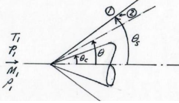
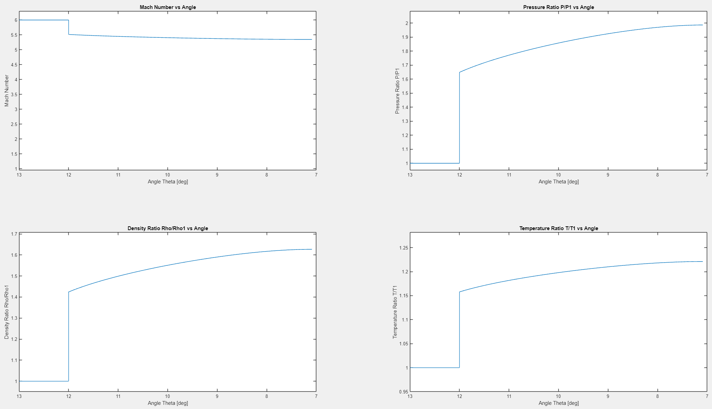

# Supersonic-Shock-Over-A-Cone
MATLAB script that models the supersonic flow over a cone at 0 angle of attack given free stream conditions and shock angle. Numerically integrates Taylor-Maccoll equation using 4th order Runge Kutta to find cone angle that satisfies boundary conditions.

To run: download this repository and run SupersonicFlowOverCone.m using MATLAB. Code specifies input variables for simulation at top of file.

## Example of Results for Given Inputs

### Diagram of cone and conical shock.

### Plot of Mach number and property ratios as a function of angle theta.

